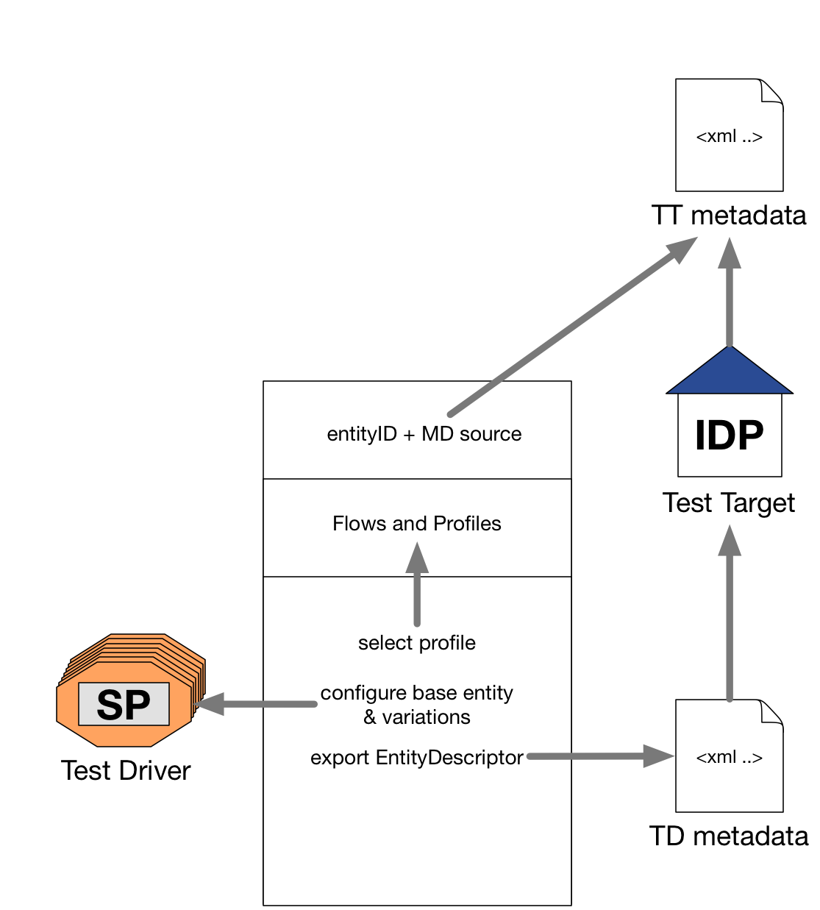

# How to run an IDP test using the web server

## Prepare the test configuration
You need to prepare the test target configuration and add the test driver's
metadata (comprising multiple entities) to the test target's entity feed.

- fork and clone the template configuration project:
  https://github.com/identinetics/saml2test2.conf

    git clone <my-config-repo-url>
    cd <my-config-repo-dir>

- adapt the test configuration:

    There are, by default, 4 config files arranged in following (class) hierarchy:
     1. config_abstr.py   (importing default config from source code repo)
     2. config_driver.py  (test driver - no need to change unless extending test cases)
     3. config_profile.py (test flows and saml profile)
     4. config.py         (test target config & interaction)

- generate the json-formatted configuration:

    gen_json_config.sh  # you need to have docker for linux/osx/windows installed
    git add --all && git commit -m 'my modification' && git push   # publish back to github

Your repo will now contain 2 files:

    generated/config.json  # your consolidated test target configuration
    generated/metdata.xml  # your test drivers metadata to be used by the test target

## Executing tests with a custome configuration

Users have only access to the web-interface and are able to override the config (partly,
of course) with their own configuration stored on github. Loading and switching to such
a config is done by a GET request:

    http://webui.samltest.fed-lab.org:8087/swconf?github=<GITHUB-REPO-NAME>&email=<USER-EMAIL>

Example:

    http://webui.samltest.fed-lab.org:8087/swconf?github=myuser/saml2test2-github-config-repo&email=me@example.org

=== Restricting Users

Users ability to switch to another config by creating a yaml file, holding lines of the form

   <GITHUB-USERNAME>: <USER-EMAIL>

and defining the file in the config using:

   def config(self):
      ...
      self.ACCESS_CONTROL_FILE = '<FILENAME>'

== Graphical Overview

