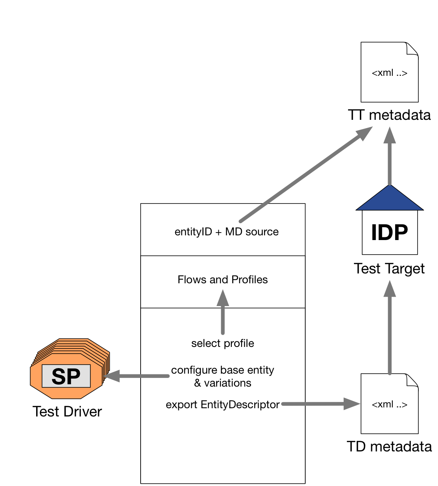

= How to run an IDP test with the web interface

Following roles is being used here:

- Test driver (TD): An embedded entity of the test tool. In the case of IDP-tests
  the TD is the SAML requester.
- Test target (TT): The entity that shall be tested. In the case of IDP-tests
  the TT is the SAML responder.

== Command Line Usage

    idp_test.py [-r <JSON-FILE>] [-m] [-j] [-g <GITHUB-REPO>] -o <OUTPUTFILE> <CONFIG-DIR>

=== Examples

==== Server startup

    idp_test.py -g <GITHUB-REPO>
    idp_test.py -r <JSON-CONFIG-FILE>
    idp_test.py <CONFIG-DIR>

This commands starts the web server. Open the test interface on localhost:8087.

==== Generators

    Writing metadata: idp_test.py -m -o <OUTPUTFILE>
    Write config in json format: idp_test.py -j -o <OUTPUTFILE>

== Switching config

=== Userdefined configs

Users have only access to the web-interface and are able to override the config (partly, of course) with
their own configuration stored on github. Loading and switching to such a config is done by a GET request:

    <URL>/swconf?github=<GITHUB-REPO-NAME>&email=<USER-EMAIL>

Example:

    http://localhost:8087/swconf?github=myuser/saml2test2-github-config-repo&email=me@example.org

=== Restricting Users

Users ability to switch to another config by creating a yaml file, holding lines of the form

   <GITHUB-USERNAME>: <USER-EMAIL>

and defining the file in the config using:

   def config(self):
      ...
      self.ACCESS_CONTROL_FILE = '<FILENAME>'

== Graphical Overview

