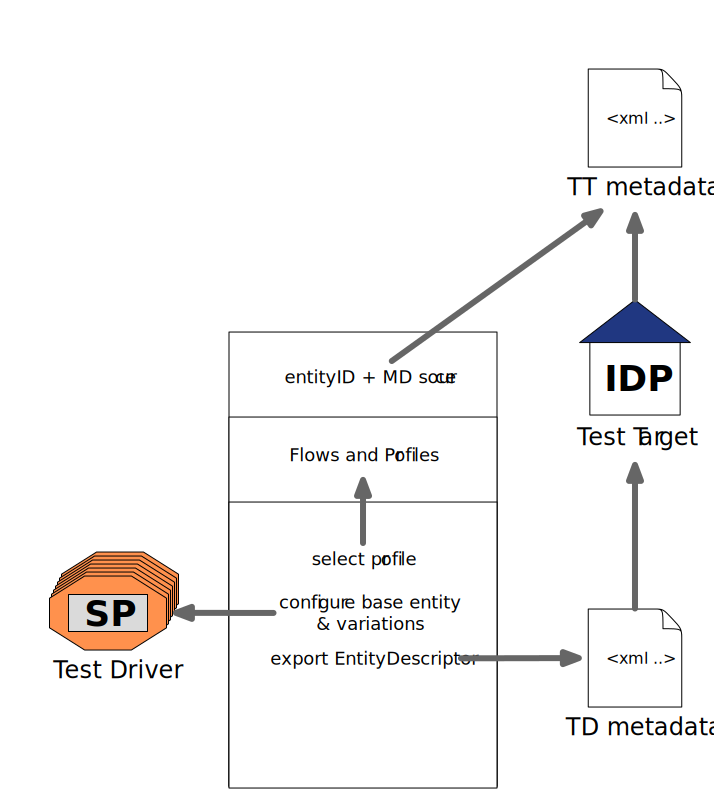

= How to run an IDP test with the web interface

Following roles is being used here:

- Test target (TT): The entity that shall be tested. In the case of IDP-tests
  the TT is the SAML responder.
- Test driver (TD): An embedded entity of the test tool. In the case of IDP-tests
  the TD is the SAML requester.

== Test Configuration

Configuration files are arranged in a hierarchy, with some files generated and others referenced. This decomentation
assigns an ID to each file to be independent of the actual naming.

.Generic configuration independent of a specific test target
|=====
|ID|Name in example|Contents
|TOOL-CONFIG|flows.yaml (or .json)|defines test flows and their order of execution
|=====

.Base configuration for a specific test target
|=====
|ID|Name in example|Contents
|TD-BASE-CONFIG|td_base_conf.py|pysaml2-style entity configuration for the test driver
|TD-VAR|td_variations.yaml|defines variations of the testdriver's base entity configuration to support tests depending on different metadata
|TT-METADATA|tt_metadata.xml|TT_METADATA|Metadata aggregate that needs to contain the test target's entityID (imported)
|=====

.Generated configuration files
|=====
|ID|Name in example|generated by|Contents
|TD-CONFIG-GEN|conf.py|build_sp_conf.py |List of test driver entities in pysaml2-style, permutation from TD-BASE-CONFIG and TD-VAR
|TD-METADATA|sps.xml|mk_multi_metadata.py|SAML EntityDescriptor for the test driver
|=====

To generate TD-CONFIG-GEN run:

    build_sp_conf.py -b <TD-BASE-CONFIG> -i <TD-CONFIG> -o <>

.Configuration files passed on invocation
|=====
|ID|Name in example|Contents
|TOOL-CONFIG|wb/test_tool.yaml| test target entityID & metadata source, test flows and profile filter, template and static dirs
|TD-CONFIG|wb/conf.py| generated using build_sp_conf.py
|=====

== Test Execution

    idp_test.py [-k] [-x] [-t test-id] -T <TOOL-CONFIG> TD-CONFIG-GEN

This command starts the web server. Setup should install it in your path.
Open the test interface on localhost:8087.